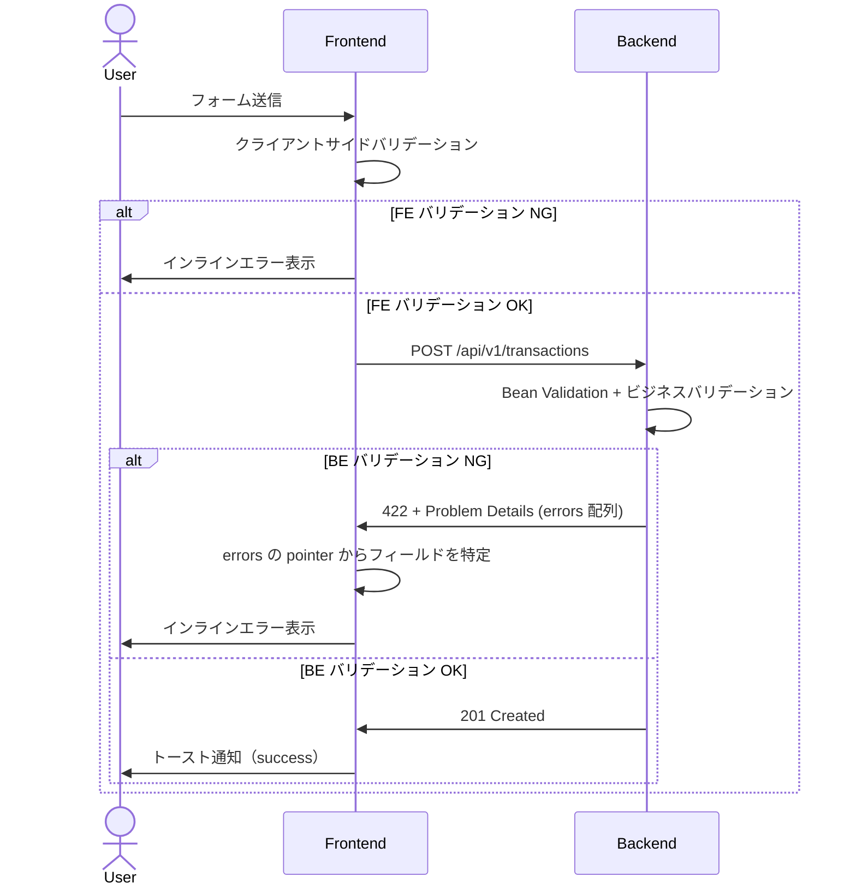
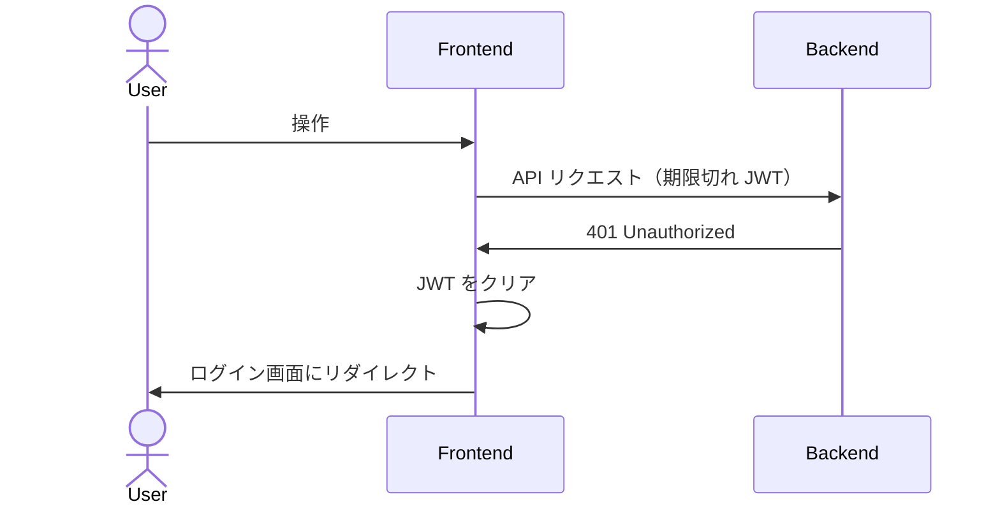
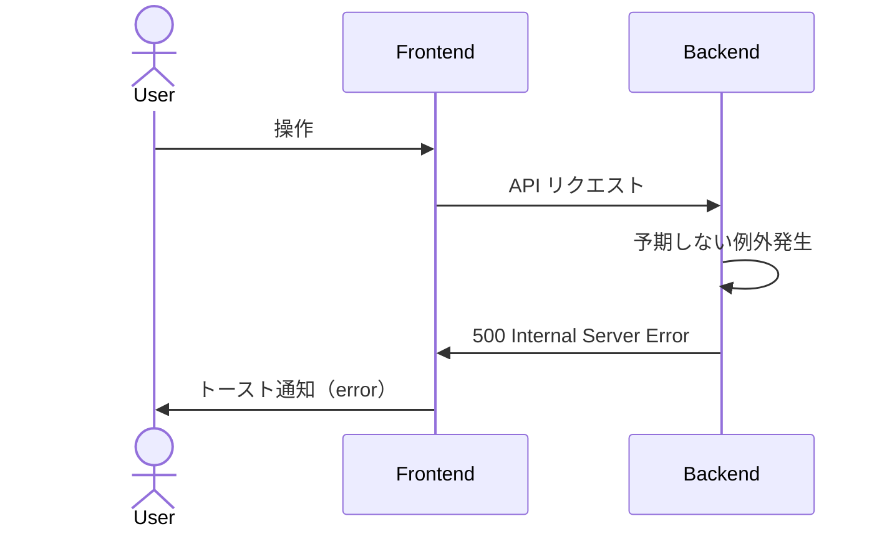

# エラーハンドリング設計

## 概要

Expense Tracker におけるエラーハンドリングの方針を定義する。
バックエンド（Spring Boot）のエラーレスポンス生成からフロントエンド（React）のエラー表示まで、
アプリケーション全体のエラー処理フローを記述する。

エラーレスポンス形式は [API 設計](../backend/api-design.md) で定義した RFC 9457 Problem Details に準拠する。

---

## 設計方針

| 項目 | 方針 |
|------|------|
| レスポンス形式 | RFC 9457 Problem Details（`application/problem+json`） |
| エラー情報の粒度 | クライアントが問題を修正できる程度の情報を提供する。内部実装の詳細は漏洩させない |
| ステータスコードの使い分け | HTTP セマンティクスに従い、適切なステータスコードを返す |
| ログ | 4xx はWARN、5xx は ERROR レベルで記録する。スタックトレースは 5xx のみ |
| セキュリティ | 他ユーザーのリソースへのアクセスは 404 で応答し、存在を秘匿する |

---

## バックエンド（Spring Boot）

### 例外クラスの階層

アプリケーション固有の例外を定義し、グローバル例外ハンドラで RFC 9457 形式に変換する。

```
RuntimeException
└── AppException (abstract)
    ├── ResourceNotFoundException        → 404
    ├── ValidationException              → 422
    ├── UnauthorizedException            → 401
    └── ForbiddenException               → 403
```

| 例外クラス | HTTP ステータス | 用途 |
|-----------|----------------|------|
| `ResourceNotFoundException` | 404 Not Found | 支出 ID が存在しない、または他ユーザーの支出 |
| `ValidationException` | 422 Unprocessable Content | ビジネスルールに基づくバリデーションエラー |
| `UnauthorizedException` | 401 Unauthorized | JWT なし・期限切れ・不正 |
| `ForbiddenException` | 403 Forbidden | 認可エラー（通常は使用せず 404 で代替） |

#### AppException の規約

- `RuntimeException` を継承する抽象クラス
- 各サブクラスのコンストラクタは `detail`（エラーメッセージ）のみを受け取り、`type` / `title` / `status` はクラス内で固定する
- `ValidationException` は追加で `List<FieldError>` を保持する。`FieldError` は `detail`（エラーメッセージ）と `field`（Java フィールドの論理名、camelCase）を持つ record とする。Presentation 層で JSON Pointer 形式（`#/snake_case`）に変換する

### グローバル例外ハンドラ

`@RestControllerAdvice` でアプリケーション全体の例外を捕捉し、RFC 9457 形式に変換する。
Spring Framework 7.0 が提供する `ProblemDetail` クラスを利用してレスポンスを生成する。

#### 処理対象の例外と規約

| 例外 | 処理内容 |
|------|---------|
| `AppException` | `type` / `title` / `status` / `detail` / `instance` を設定。`ValidationException` の場合は `errors` 配列も追加 |
| `MethodArgumentNotValidException` | Bean Validation エラー。422 で応答し、フィールドエラーを `errors` 配列に変換 |
| `HttpMessageNotReadableException` | JSON パースエラー。400 で応答 |
| `MethodArgumentTypeMismatchException` | クエリパラメータの型不正。400 で応答 |
| `Exception` | その他の予期しないエラー。500 で応答 |

#### ProblemDetail の共通規約

- すべてのハンドラで `instance` にリクエスト URI を設定する
- Content-Type は `application/problem+json` を明示する
- 500 エラーではスタックトレースやエラーの技術的詳細をレスポンスに含めない（ログにのみ出力）

### エラー種別ごとの処理

#### Bean Validation エラー（422）

Controller の `@Valid` によるリクエストボディのバリデーション違反。
`MethodArgumentNotValidException` を捕捉し、フィールドエラーを `errors` 配列に変換する。

**pointer のフィールド名変換**: Java のキャメルケース（`categoryId`）を API のスネークケース（`category_id`）に変換して返す。

#### ビジネスバリデーションエラー（422）

Bean Validation では検証できないビジネスルール違反。Service 層で `ValidationException` をスローする。

| ルール | エラーメッセージ | pointer |
|--------|---------------|---------|
| 存在しないカテゴリ ID | `category not found` | `#/category_id` |

#### 認証エラー（401）

Spring Security のフィルターチェーンで JWT 検証に失敗した場合。
`AuthenticationEntryPoint` をカスタマイズし、RFC 9457 形式で応答する。

#### リソース不在（404）

指定された ID のリソースが存在しない、または他ユーザーのリソースにアクセスした場合。
Service 層で `ResourceNotFoundException` をスローする。

**他ユーザーのリソースアクセスも 404 を返す**理由は [API 設計](../backend/api-design.md) の設計メモを参照。

#### JSON パースエラー（400）

不正な JSON がリクエストボディとして送信された場合。

#### クエリパラメータの型不正（400）

クエリパラメータの型変換に失敗した場合（例: `category_id=abc`）。

#### 予期しないエラー（500）

上記のいずれにも該当しない例外。

- スタックトレースをレスポンスに含めない（ログにのみ出力）
- `detail` にエラーの技術的詳細を含めない

### ログ方針

| HTTP ステータス | ログレベル | スタックトレース | 用途 |
|----------------|-----------|----------------|------|
| 400 | WARN | なし | クライアントの不正リクエスト |
| 401 | WARN | なし | 認証失敗 |
| 403 | WARN | なし | 認可失敗 |
| 404 | DEBUG | なし | リソース不在（正常系に近い） |
| 422 | WARN | なし | バリデーションエラー |
| 500 | ERROR | あり | サーバー内部エラー（調査が必要） |

ログには以下の情報を含める:
- HTTP メソッド
- リクエスト URI
- ステータスコード
- エラーメッセージ
- ユーザー ID（認証済みの場合）

---

## フロントエンド（React + TanStack Query）

### API クライアントのエラー処理

API クライアント（fetch ラッパー）でレスポンスステータスを検査し、エラー時は構造化された例外をスローする。

#### 規約

- レスポンスが `!response.ok` の場合、ボディを RFC 9457 の `ApiError` としてパースし、`ApiException` をスローする
- `fetch` が `TypeError` をスローするケース（ネットワーク切断、DNS 解決失敗、CORS エラーなど）は `NetworkException` に変換する
- 401 レスポンスを受信した場合、JWT をクリアしてログイン画面にリダイレクトする（グローバル処理）

### TanStack Query でのエラーハンドリング

#### リトライ方針

- Query: 認証エラー・バリデーションエラー（401, 403, 404, 422）はリトライしない。その他は最大 3 回リトライ
- Mutation: リトライしない

#### Mutation のエラー処理

- 422（バリデーションエラー）→ フォームの該当フィールドにインラインエラーを表示
- その他 → トースト通知

### エラー種別ごとの UI 表示

| HTTP ステータス | エラー種別 | FE の処理 |
|----------------|----------|----------|
| 401 | 認証エラー | JWT をクリアし、ログイン画面にリダイレクト |
| 404 | リソース不在 | トースト通知 + 一覧画面に戻す |
| 422 | バリデーションエラー | フォームの該当フィールドにインラインエラーを表示 |
| 500 | サーバーエラー | トースト通知（「Something went wrong. Please try again.」） |
| - | ネットワークエラー | トースト通知（「Network error. Please check your connection.」） |

### バリデーションエラー（422）のフォーム連携

`errors` 配列の `pointer` からフィールド名を取得し（`#/amount` → `amount`）、フォームの対応するフィールドにエラーメッセージを表示する。

**pointer → フィールド名のマッピング**:

| pointer | フォームフィールド |
|---------|----------------|
| `#/date` | date |
| `#/amount` | amount |
| `#/category_id` | category_id |
| `#/need_want_type` | need_want_type |
| `#/title` | title |
| `#/memo` | memo |

### トースト通知

[画面フロー](../frontend/screen-flow.md) で定義したトースト通知の仕様に従う。

| 通知タイプ | 表示位置 | 自動非表示 | 手動閉じ |
|-----------|---------|-----------|---------|
| success | 画面上部 | 3秒後 | 可 |
| error | 画面上部 | なし（タップで閉じる） | 必須 |

---

## エラー種別カタログ

### 認証・認可

| type | title | status | detail | 発生条件 |
|------|-------|--------|--------|---------|
| `/errors/unauthorized` | Authentication required. | 401 | The access token is missing or invalid. | JWT なし・期限切れ・署名不正 |
| `/errors/forbidden` | Forbidden. | 403 | You do not have permission to access this resource. | 認可エラー（通常は 404 で代替） |

### バリデーション

| type | title | status | detail | 発生条件 |
|------|-------|--------|--------|---------|
| `/errors/validation-error` | Your request is not valid. | 422 | One or more fields have validation errors. | 入力値のバリデーション違反 |

**フィールド別のバリデーションメッセージ**:

| pointer | バリデーション | detail |
|---------|--------------|--------|
| `#/date` | 必須 | `must not be null` |
| `#/date` | 形式 | `must be a valid date in ISO 8601 format` |
| `#/amount` | 必須 | `must not be null` |
| `#/amount` | 正の数値 | `must be greater than 0` |
| `#/amount` | 小数桁数 | `too many decimal places for {currency}` |
| `#/category_id` | 存在チェック | `category not found` |
| `#/need_want_type` | Enum 値 | `must be one of: NEED, WANT, UNSET` |
| `#/title` | 文字数上限 | `must be at most 200 characters` |
| `#/memo` | 文字数上限 | `must be at most 2000 characters` |
| `#/id_token` | 必須 | `must not be null` |

### リソース操作

| type | title | status | detail | 発生条件 |
|------|-------|--------|--------|---------|
| `about:blank` | Not Found | 404 | The requested transaction was not found. | 支出 ID が存在しない / 他ユーザーの支出 |
| `about:blank` | Not Found | 404 | The requested resource was not found. | その他のリソース不在 |

### リクエスト不正

| type | title | status | detail | 発生条件 |
|------|-------|--------|--------|---------|
| `about:blank` | Bad Request | 400 | Failed to parse request body. | JSON パースエラー |
| `about:blank` | Bad Request | 400 | Invalid value for parameter '{name}'. | クエリパラメータの型不正 |

### サーバーエラー

| type | title | status | detail | 発生条件 |
|------|-------|--------|--------|---------|
| `about:blank` | Internal Server Error | 500 | An unexpected error occurred. | 予期しない例外 |

---

## FE バリデーション（クライアントサイド）

サーバーへのリクエスト送信前に、FE 側でも入力値を検証する。
FE バリデーションは UX 向上が目的であり、BE バリデーションの代替ではない。

### バリデーションルール

| フィールド | ルール | エラーメッセージ |
|-----------|-------|---------------|
| date | 必須 | `Date is required` |
| amount | 必須 | `Amount is required` |
| amount | 正の数値 | `Amount must be greater than 0` |
| amount | 通貨に応じた小数桁数 | `Invalid decimal places for {currency}` |
| title | 200文字以内 | `Title must be 200 characters or less` |
| memo | 2000文字以内 | `Memo must be 2000 characters or less` |

### FE / BE バリデーションの役割分担

| チェック内容 | FE | BE | 備考 |
|------------|----|----|------|
| 必須チェック | ○ | ○ | FE で即時フィードバック |
| 型・形式チェック | ○ | ○ | FE で入力時に即検証 |
| 文字数上限 | ○ | ○ | FE で入力制限 |
| 通貨に応じた小数桁数 | ○ | ○ | FE はユーザーの通貨設定を参照 |
| カテゴリ ID の存在チェック | - | ○ | FE はプリセットから選択するため不要 |
| リソースの所有者チェック | - | ○ | サーバーサイドのみで実施 |

---

## エラー処理のシーケンス

### バリデーションエラーの場合



### 認証エラーの場合



### サーバーエラーの場合



---

## 設計メモ

### ProblemDetail を Spring 標準クラスで生成する理由

Spring Framework 7.0 が提供する `ProblemDetail` クラスを使用することで、
RFC 9457 準拠のレスポンスを手動で JSON を組み立てることなく生成できる。
`setProperty()` で拡張メンバー（`errors` 配列など）も追加可能。

### FE でクライアントサイドバリデーションを行う理由

- ユーザーがフォーム送信前に即座にフィードバックを得られる（UX 向上）
- 明らかに不正なリクエストをサーバーに送信しないことで、不要な通信を削減できる
- ただし、FE バリデーションは容易にバイパスできるため、BE バリデーションは必須

### エラーメッセージを英語で統一する理由

UI 言語が英語のみ（[要件定義](../../02-requirements/requirements.md) の非機能要件）であるため、
エラーメッセージもすべて英語で統一する。将来の多言語対応時にメッセージの国際化を検討する。

### 予期しないエラーの detail を固定文言にする理由

500 エラーの `detail` に例外メッセージやスタックトレースを含めると、
内部実装の情報（クラス名、SQL、ファイルパスなど）が漏洩するリスクがある。
クライアントには固定の汎用メッセージを返し、詳細はサーバーログにのみ記録する。
