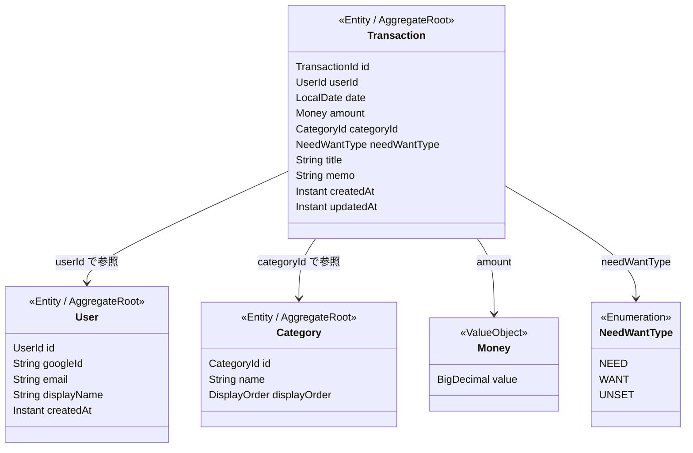

# ドメインモデル

## 概要

本アプリは「支出の記録・把握」に特化しているため、ドメインモデルはシンプルに保つ。
収入管理・口座管理・予算管理は対象外とし、支出記録とその分類に必要な概念のみを定義する。

---

## ドメインモデル図



---

## エンティティ

### User（ユーザー）

Google OAuth2 で認証されたユーザーを表す。

| フィールド | 型 | 必須 | 説明 |
|-----------|-----|------|------|
| id | UserId | ○ | 内部ID（自動採番） |
| googleId | String | ○ | Google アカウントの識別子（sub クレーム） |
| email | String | ○ | メールアドレス |
| displayName | String | ○ | 表示名 |
| createdAt | Instant | ○ | 登録日時 |

**ルール**
- googleId はシステム内で一意
- 初回ログイン時に自動作成される（明示的なユーザー登録画面は持たない）

---

### Transaction（支出記録）

アプリの中心となるエンティティ。ユーザーが記録する1件1件の支出。

| フィールド | 型 | 必須 | 説明 |
|-----------|-----|------|------|
| id | TransactionId | ○ | 内部ID（自動採番） |
| userId | UserId | ○ | 所有ユーザー |
| date | LocalDate | ○ | 支出日 |
| amount | Money | ○ | 金額 |
| categoryId | CategoryId | ○ | カテゴリ（デフォルト: 未分類） |
| needWantType | NeedWantType | ○ | need / want 分類（デフォルト: UNSET） |
| title | String | - | 内容（例：「ランチ」「電車代」） |
| memo | String | - | メモ |
| createdAt | Instant | ○ | 作成日時 |
| updatedAt | Instant | ○ | 更新日時 |

**ルール**
- 金額は 1 以上の正の値
- 日付は未来日を許容する（立替や前払いなどのケースを考慮）
- カテゴリ未選択時は「未分類」カテゴリが設定される
- need/want 未選択時は UNSET が設定される
- 支出記録は所有ユーザーのみが閲覧・編集・削除できる

---

### Category（カテゴリ）

支出を分類するためのマスタデータ。MVP ではプリセットのみ提供し、ユーザーによるカスタマイズは将来対応とする。

| フィールド | 型 | 必須 | 説明 |
|-----------|-----|------|------|
| id | CategoryId | ○ | 内部ID（自動採番） |
| name | String | ○ | カテゴリ名 |
| displayOrder | Integer | ○ | 表示順 |

**プリセットカテゴリ**

| 表示順 | 名前 | 想定される用途 |
|-------|------|--------------|
| 1 | 食費 | 食料品・外食 |
| 2 | 交通費 | 電車・バス・タクシー |
| 3 | 住居費 | 家賃・光熱費・通信費 |
| 4 | 日用品 | 消耗品・生活雑貨 |
| 5 | 医療費 | 病院・薬 |
| 6 | 娯楽 | 趣味・レジャー・サブスク |
| 7 | 衣服 | 衣料品・クリーニング |
| 8 | 教育 | 書籍・セミナー・資格 |
| 9 | 交際費 | 飲み会・プレゼント |
| 10 | その他 | 上記に該当しないもの |
| 11 | 未分類 | カテゴリ未選択時のデフォルト |

**ルール**
- カテゴリはシステム共通（全ユーザーで同じプリセットを使用）
- 「未分類」は常に存在し、削除できない
- 将来、ユーザー独自のカテゴリ作成を可能にする拡張を想定

---

## 値オブジェクト

### Money（金額）

金額を表す値オブジェクト。

| フィールド | 型 | 説明 |
|-----------|-----|------|
| value | BigDecimal | 金額の値 |

**ルール**
- 0 より大きい正の値であること
- MVP では日本円を前提とし、整数のみ許容する
- 通貨の概念は MVP では持たない

**設計判断**
- `BigDecimal` を使い浮動小数点の誤差を回避する
- 将来のグローバル化に備え、`Money(value, currency)` へ拡張可能な構造にしておく。具体的には金額を Money 値オブジェクトとして分離しているため、Currency フィールドの追加やバリデーションルールの通貨別切り替えが局所的な変更で済む

---

## 列挙型

### NeedWantType（need / want 分類）

支出を「必要」か「欲しい」かで分類する。あとから設定することも想定し、未設定状態を明示的に持つ。

| 値 | 説明 |
|----|------|
| NEED | 必要な支出（食費、家賃、通勤費など） |
| WANT | 欲しいから使った支出（趣味、外食、嗜好品など） |
| UNSET | 未設定（デフォルト） |

> 分析画面では UNSET の件数・金額を表示し、ユーザーに分類の振り返りを促す。

---

## 集約の設計

Spring Data JDBC の Aggregate / Repository パターンに沿って、集約を設計する。

### 集約の一覧

| 集約 | AggregateRoot | 含まれるオブジェクト |
|------|---------------|-------------------|
| User 集約 | User | なし（単体） |
| Transaction 集約 | Transaction | Money（値オブジェクト） |
| Category 集約 | Category | なし（単体） |

### 集約間の参照

集約間は ID による参照とし、オブジェクト参照は持たない。
これは Spring Data JDBC の設計原則に従い、集約の独立性を保つため。

```
Transaction
  ├── userId: UserId         → User 集約への参照
  └── categoryId: CategoryId → Category 集約への参照
```

---

## 未選択の表現方針

| フィールド | 未選択の表現 | 理由 |
|-----------|------------|------|
| categoryId | 「未分類」カテゴリ（ID参照） | FK 制約が効く。集計クエリで null ハンドリングが不要になり、GROUP BY がシンプルになる |
| needWantType | UNSET（Enum値） | NOT NULL 制約が使える。分析画面で「未設定 ○件」と表示し、分類の振り返りを促せる |
| title | null | 任意の自由入力。空文字ではなく null で「未入力」を表現 |
| memo | null | 同上 |

---

## ID の型

`UserId`、`TransactionId`、`CategoryId` はプリミティブ型のラッパーとして定義する。
Java の Record を使い、型安全性を確保する。

```java
public record UserId(Long value) {}
public record TransactionId(Long value) {}
public record CategoryId(Long value) {}
```

これにより、`findById(UserId)` と `findById(TransactionId)` のような引数の取り違えをコンパイル時に検出できる。

---

## 設計メモ

### Account（口座）を持たない理由

一般的な家計簿アプリでは「どの口座から支払ったか」を管理する Account エンティティを持つが、
本アプリは「何にいくら使ったか」の記録に特化するため、意図的に除外している。
これにより、入力項目が減り、初心者でも迷わず記録できるシンプルさを実現する。

### Budget（予算）を持たない理由

予算管理は支出記録の習慣化が定着した後のステップと位置づけ、MVP のスコープ外とした。
将来フェーズでの追加を想定し、Transaction に budget 関連のフィールドは含めていない。
