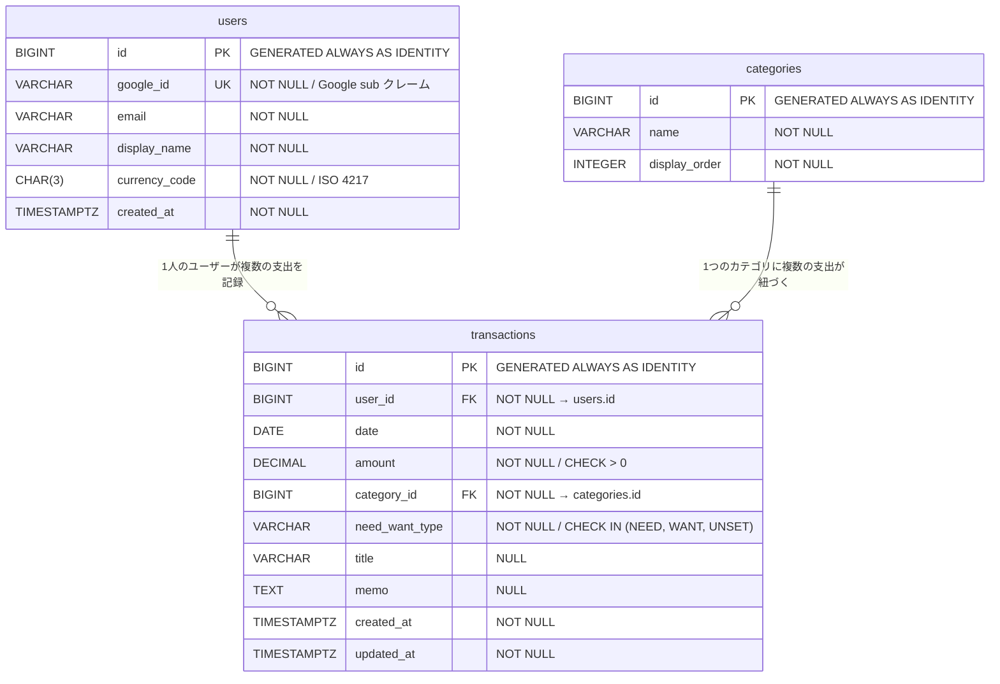

# ER図

## 概要

ドメインモデルをリレーショナルデータベース（PostgreSQL）のテーブル構成に落とし込んだ ER 図。
カラムの精度・桁数やインデックスの詳細は [database-schema.md](database-schema.md) で定義する。

---

## ER図

---

## テーブル一覧

| テーブル | 対応するドメインモデル | 役割 |
|---------|---------------------|------|
| users | User（AggregateRoot） | Google 認証ユーザー |
| transactions | Transaction（AggregateRoot） | 支出記録 |
| categories | Category（AggregateRoot） | 支出カテゴリのマスタデータ |

---

## リレーション

| 親 | 子 | カーディナリティ | 説明 |
|----|-----|-----------------|------|
| users | transactions | 1 対 多 | 1人のユーザーが0件以上の支出を記録する |
| categories | transactions | 1 対 多 | 1つのカテゴリに0件以上の支出が紐づく |

---

## ドメインモデルからの変換ポイント

### 値オブジェクトの展開

| ドメインモデル | DB カラム | 変換方針 |
|--------------|----------|---------|
| Money（value: BigDecimal） | transactions.amount（DECIMAL） | 値オブジェクトをカラムに展開。通貨情報は users.currency_code で管理 |

### 列挙型の格納

| ドメインモデル | DB カラム | 格納方式 |
|--------------|----------|---------|
| NeedWantType（NEED / WANT / UNSET） | transactions.need_want_type（VARCHAR） | VARCHAR + CHECK 制約。Flyway でのマイグレーション管理のしやすさを優先 |

### ID型の展開

| ドメインモデル | DB 型 | 採番方式 |
|--------------|-------|---------|
| UserId | BIGINT | GENERATED ALWAYS AS IDENTITY |
| TransactionId | BIGINT | GENERATED ALWAYS AS IDENTITY |
| CategoryId | BIGINT | GENERATED ALWAYS AS IDENTITY |

> **GENERATED ALWAYS AS IDENTITY について**
> PostgreSQL 10 以降で推奨される自動採番方式。従来の `SERIAL` と比べて SQL 標準準拠であり、
> 意図しない手動挿入を防ぐ（`ALWAYS` により外部からの値指定を原則禁止する）。

### 集約間の参照

ドメインモデルでは集約間を ID で参照する設計としている。DB ではこれを外部キー制約として表現する。

| カラム | 参照先 | 制約 |
|-------|-------|------|
| transactions.user_id | users.id | FOREIGN KEY / NOT NULL |
| transactions.category_id | categories.id | FOREIGN KEY / NOT NULL |

---

## 命名規則

| 対象 | 規則 | 例 |
|------|------|-----|
| テーブル名 | snake_case・複数形 | users, transactions, categories |
| カラム名 | snake_case | user_id, display_name, need_want_type |
| 主キー | id | 各テーブル共通 |
| 外部キー | {参照先テーブル単数形}_id | user_id, category_id |
| タイムスタンプ | created_at, updated_at | UTC で保存（TIMESTAMPTZ） |

> **Java → DB の命名変換**
> ドメインモデル（camelCase）から DB（snake_case）への変換は Spring Data JDBC の
> `NamingStrategy` がデフォルトで行う。明示的なマッピング設定は不要。

---

## database-schema.md への申し送り事項

以下の詳細は database-schema.md で定義する。

- VARCHAR カラムの最大長（google_id, email, display_name, name, title, need_want_type）
- DECIMAL の精度・スケール（amount）
- インデックス設計（検索・フィルタリング用）
- CHECK 制約の具体的な定義文
- categories テーブルの初期データ（Flyway のマイグレーションスクリプト）
- ON DELETE 時の振る舞い（RESTRICT / CASCADE）
