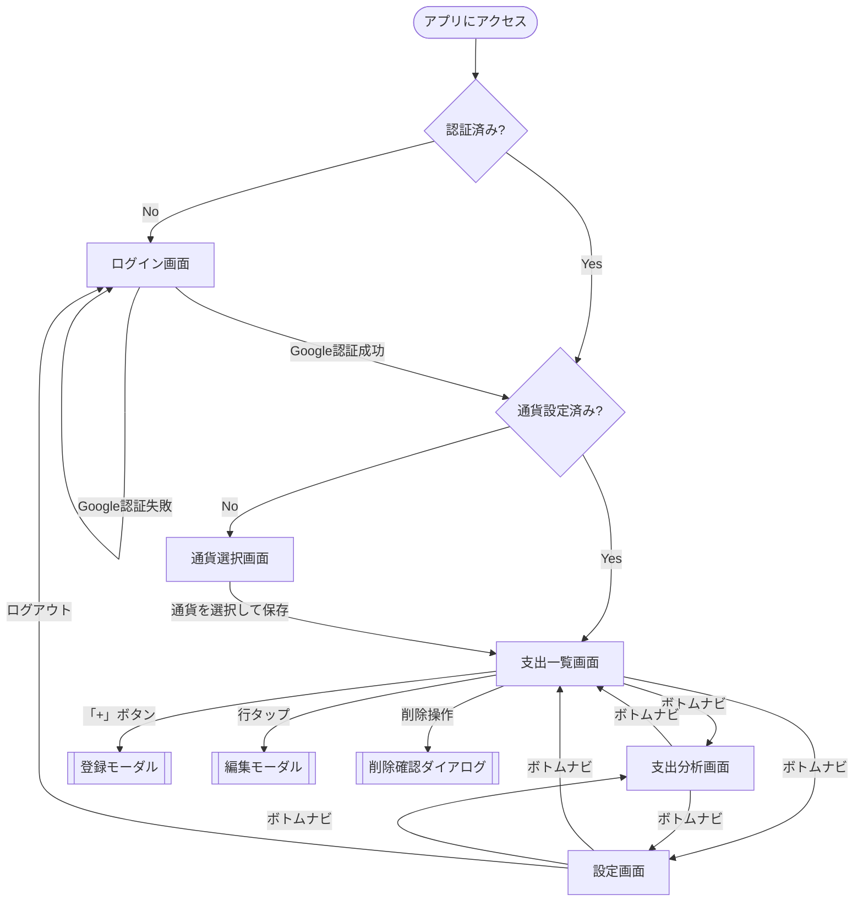
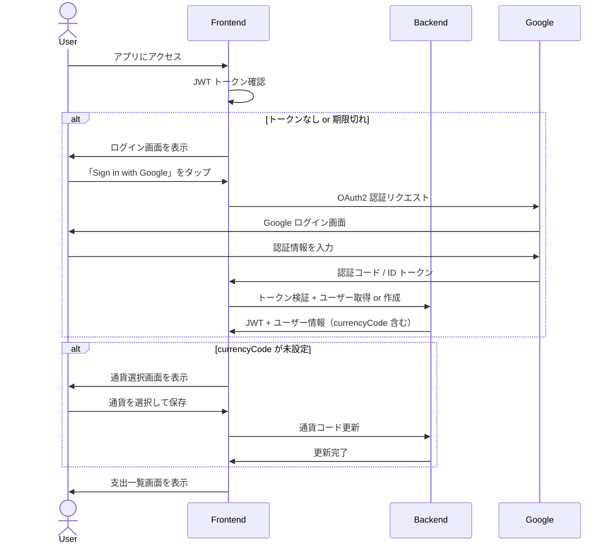

# 画面フロー

## 概要

本アプリの画面構成と遷移を定義する。
モバイルファーストで設計し、PC・タブレットではレスポンシブに適応する。

---

## 画面一覧

| # | 画面 | パス | 認証 | 説明 |
|---|------|------|------|------|
| 1 | ログイン | `/login` | 不要 | Google OAuth2 によるログイン |
| 2 | 通貨選択 | `/setup/currency` | 必要 | 初回ログイン時の通貨設定 |
| 3 | 支出一覧 | `/transactions` | 必要 | メイン画面。支出の一覧表示・登録・編集・削除 |
| 4 | 支出分析 | `/analytics` | 必要 | カテゴリ別割合・need/want 比率の表示 |
| 5 | 設定 | `/settings` | 必要 | 通貨変更・アカウント管理 |

---

## 画面フロー図



---

## ナビゲーション

### ボトムナビゲーション

認証後のすべての画面で表示する。3タブ構成。

| 順序 | ラベル | アイコン | 遷移先 |
|------|--------|---------|--------|
| 1 | Transactions | 📝（リストアイコン） | `/transactions` |
| 2 | Analytics | 📊（チャートアイコン） | `/analytics` |
| 3 | Settings | ⚙️（歯車アイコン） | `/settings` |

> **アイコンについて**
> 上記の絵文字は概念を示すもの。実装では Lucide React 等のアイコンライブラリを使用する。

### PC・タブレット対応

ボトムナビゲーションはモバイルの標準パターン。PC/タブレットの広い画面では、ボトムナビを維持するか
サイドバーに切り替えるかを実装時に判断する。MVP ではボトムナビ統一で進め、必要に応じてリファクタリングする。

---

## 各画面の詳細

### 1. ログイン画面（`/login`）

Google OAuth2 によるログイン画面。

**表示要素**
- アプリ名 / ロゴ
- 「Sign in with Google」ボタン
- エラーメッセージ表示エリア（認証失敗時）

**振る舞い**
- 未認証ユーザーがアプリにアクセスすると、この画面にリダイレクトされる
- Google 認証成功後、ユーザーが DB に存在しなければ自動作成し、通貨選択画面へ遷移する
- 既存ユーザーの場合は支出一覧画面へ遷移する

---

### 2. 通貨選択画面（`/setup/currency`）

初回ログイン時に通貨を設定する画面。Google アカウントの locale から通貨を推定し、デフォルト値として表示する。

**表示要素**
- 説明テキスト（「Confirm your currency」）
- 推定された通貨をデフォルト選択状態で表示
- 通貨選択リスト（検索・フィルター付き）
  - 通貨コード + 通貨名 + 記号を表示（例: `JPY - Japanese Yen (¥)`）
  - よく使われる通貨を上部に表示（JPY, USD, EUR, GBP など）
- 「Save」ボタン

**通貨の自動推定**

Google OAuth2 の userinfo に含まれる `locale` クレーム（例: `ja`, `en-US`）から国を特定し、通貨にマッピングする。

| locale 例 | 国 | 推定通貨 |
|-----------|-----|---------|
| `ja` | Japan | JPY |
| `en-US` | United States | USD |
| `en-GB` | United Kingdom | GBP |
| `de` | Germany | EUR |
| `zh-CN` | China | CNY |

- locale → 通貨のマッピングテーブルはバックエンドで管理する
- マッピングできない locale の場合は USD をフォールバックとする
- 推定結果はあくまでデフォルト値であり、ユーザーは自由に変更できる

**振る舞い**
- 推定通貨がデフォルト選択された状態で画面を表示する（ユーザーは確認して Save するだけ）
- 推定が合っていれば1タップで完了。違っていればリストから変更可能
- 保存後、支出一覧画面へ遷移する
- 通貨が未設定のユーザーがこの画面以外にアクセスした場合、この画面にリダイレクトする
- 設定画面から通貨変更も可能（この画面は初回専用）

---

### 3. 支出一覧画面（`/transactions`）

アプリのメイン画面。支出の閲覧・登録・編集・削除を行う。

**表示要素**

```
┌─────────────────────────────────┐
│ ◀  February 2026  ▶     [All ▾]│  ← 期間セレクタ（月/年/すべて）
│                                 │
│ [🔍 Filter]                     │  ← フィルターエリア
│                                 │
│ ── Feb 23, Sun ──────────────── │  ← 日付ヘッダー
│ 🍽 Lunch          ¥1,200  NEED  │  ← 支出行
│ 🚃 Train fare       ¥220  NEED  │
│                                 │
│ ── Feb 22, Sat ──────────────── │
│ 🎮 Game            ¥3,500  WANT │
│ 🍽 Groceries       ¥2,800  NEED │
│ ── Uncategorized ────           │
│    Coffee            ¥500       │
│                                 │
│               ...               │
│                                 │
│                          [ + ]  │  ← FAB（登録ボタン）
│                                 │
│ [📝 Transactions] [📊] [⚙️]     │  ← ボトムナビ
└─────────────────────────────────┘
```

**期間セレクタ**

| 表示単位 | 表示形式 | 前後切替 |
|---------|---------|---------|
| 月 | `◀ February 2026 ▶` | ◀▶ ボタンで前月・翌月 |
| 年 | `◀ 2026 ▶` | ◀▶ ボタンで前年・翌年 |
| すべて | `All Transactions` | 切替なし |

- デフォルトは「月」表示、当月を表示
- ドロップダウンまたはセグメントコントロールで月/年/すべてを切替

**フィルター**

| フィルター項目 | UI | 説明 |
|-------------|-----|------|
| キーワード | テキスト入力 | title, memo を部分一致検索 |
| カテゴリ | ドロップダウン（複数選択可） | プリセットカテゴリから選択 |
| need/want | セグメント / チップ | NEED / WANT / UNSET で絞り込み |

- フィルターはデフォルトで折りたたみ、タップで展開する
- フィルター適用中は視覚的にアクティブ状態を示す（バッジ等）

**支出一覧**
- 日付ごとにグループ化して表示する
- 各行にはカテゴリアイコン（絵文字）、title（未入力時はカテゴリ名を表示）、金額、need/want を表示
- 行タップで編集モーダルを開く
- 一覧が空の場合は、空状態メッセージと登録を促すガイドを表示

**FAB（Floating Action Button）**
- 画面右下に常時表示する「+」ボタン
- タップで登録モーダルを開く

---

### 3a. 登録モーダル

支出一覧画面上にオーバーレイ表示するモーダル。

**表示要素**

| フィールド | UI | 必須 | デフォルト |
|-----------|-----|------|-----------|
| 日付 | 日付ピッカー | ○ | 今日 |
| 金額 | 数値入力（通貨フォーマット付き） | ○ | - |
| カテゴリ | ドロップダウン / グリッド選択 | - | Uncategorized |
| need/want | 3択セグメント（NEED / WANT / UNSET） | - | UNSET |
| 内容（title） | テキスト入力 | - | - |
| メモ | テキストエリア | - | - |

**振る舞い**
- 金額入力にフォーカスを自動設定する（最も入力頻度が高いため）
- 金額は通貨に応じた小数桁数でバリデーションする（例: JPY → 整数のみ、USD → 小数2桁まで）
- 「Save」で保存して閉じる。一覧を更新する
- 「Cancel」または背景タップで閉じる（入力内容がある場合は破棄確認）
- 保存成功時はトースト通知で確認（「Transaction saved」）

**金額入力の UX**
- 通貨記号をプレフィックス表示する（例: `¥` `$`）
- テンキー（モバイル）でスムーズに入力できるよう `inputmode="decimal"` を設定

---

### 3b. 編集モーダル

登録モーダルと同じレイアウト。既存データを初期値として表示する。

**登録モーダルとの差分**
- モーダルタイトルが「Edit Transaction」になる
- 削除ボタン（🗑）を表示する
- 削除タップで削除確認ダイアログを表示する

---

### 3c. 削除確認ダイアログ

編集モーダル上にさらにオーバーレイ表示する確認ダイアログ。

**表示要素**
- メッセージ:「Delete this transaction?」
- 対象の支出情報（日付、金額、title）を表示し、何を削除するか明確にする
- 「Delete」ボタン（破壊的操作として赤色で強調）
- 「Cancel」ボタン

**振る舞い**
- 「Delete」で物理削除を実行し、編集モーダルも閉じる。一覧を更新する
- 削除成功時はトースト通知（「Transaction deleted」）
- 「Cancel」で確認ダイアログのみ閉じ、編集モーダルに戻る

---

### 4. 支出分析画面（`/analytics`）

記録した支出の分析結果を表示する画面。

**表示要素**

```
┌─────────────────────────────────┐
│ ◀  February 2026  ▶     [All ▾]│  ← 期間セレクタ（一覧と同じ仕様）
│                                 │
│ ┌─ Category Breakdown ────────┐ │
│ │                             │ │
│ │      [ 円グラフ / ドーナツ ]  │ │
│ │                             │ │
│ │  🍽 Food        ¥45,000 35% │ │
│ │  🏠 Housing     ¥30,000 23% │ │
│ │  🚃 Transport   ¥15,000 12% │ │
│ │  ...                        │ │
│ └─────────────────────────────┘ │
│                                 │
│ ┌─ Need / Want Ratio ─────────┐ │
│ │                             │ │
│ │  NEED  ████████░░  ¥80,000  │ │
│ │  WANT  ████░░░░░░  ¥35,000  │ │
│ │  UNSET ██░░░░░░░░  ¥15,000  │ │
│ │                             │ │
│ │  ⚠ 3 transactions unset    │ │
│ └─────────────────────────────┘ │
│                                 │
│ [📝] [📊 Analytics] [⚙️]       │  ← ボトムナビ
└─────────────────────────────────┘
```

**期間セレクタ**
- 支出一覧画面と同じ仕様（月/年/すべて、前後切替）
- デフォルトは「月」表示、当月を表示

**カテゴリ別支出割合（Category Breakdown）**
- ドーナツチャートまたは円グラフで割合を視覚化する
- チャートの下にカテゴリごとの金額と割合をリスト表示する
- 金額 0 のカテゴリは非表示
- カテゴリアイコン（絵文字）を併記して直感的に把握できるようにする

**need/want 比率（Need / Want Ratio）**
- 横棒グラフまたはプログレスバーで NEED / WANT / UNSET の割合を表示する
- 各区分の金額も併記する
- UNSET が存在する場合は件数を表示し、分類の振り返りを促すメッセージを出す
  - 例: 「⚠ 3 transactions unset — tap to review」

**データなしの場合**
- 期間内にデータがない場合は空状態メッセージを表示する
  - 例: 「No transactions this month. Start recording!」

---

### 5. 設定画面（`/settings`）

アプリの設定とアカウント管理を行う画面。

**表示要素**

```
┌─────────────────────────────────┐
│ Settings                        │
│                                 │
│ ┌─ Account ───────────────────┐ │
│ │  user@gmail.com             │ │
│ │  Display Name               │ │
│ └─────────────────────────────┘ │
│                                 │
│ ┌─ Preferences ───────────────┐ │
│ │  Currency         JPY (¥) ▶ │ │
│ └─────────────────────────────┘ │
│                                 │
│ ┌─ Danger Zone ───────────────┐ │
│ │  [Log out]                  │ │
│ │  [Delete Account]           │ │
│ └─────────────────────────────┘ │
│                                 │
│ [📝] [📊] [⚙️ Settings]        │  ← ボトムナビ
└─────────────────────────────────┘
```

**Account セクション**
- Google アカウントのメールアドレスと表示名を表示する（読み取り専用）

**Preferences セクション**
- 通貨変更: タップで通貨選択画面と同等の UI を表示する（モーダルまたはインライン選択）
- 通貨変更時は確認メッセージを表示する
  - 「Changing currency only affects how amounts are displayed. Existing data will not be converted.」

**Danger Zone セクション**
- **Log out**: ログアウトしてログイン画面に遷移する
- **Delete Account**: アカウントとすべての支出記録を削除する
  - 確認ダイアログを表示する（「This will permanently delete your account and all transactions. This action cannot be undone.」）
  - 削除実行後、ログイン画面に遷移する

---

## 画面遷移の詳細

### 認証フロー



### 画面間の遷移パターン

| 遷移元 | 操作 | 遷移先 | 方式 |
|-------|------|-------|------|
| どこからでも（未認証） | - | ログイン画面 | リダイレクト |
| ログイン画面 | Google 認証成功（新規） | 通貨選択画面 | リダイレクト |
| ログイン画面 | Google 認証成功（既存） | 支出一覧画面 | リダイレクト |
| 通貨選択画面 | 保存 | 支出一覧画面 | リダイレクト |
| 支出一覧画面 | 「+」ボタン | 登録モーダル | モーダルオーバーレイ |
| 支出一覧画面 | 行タップ | 編集モーダル | モーダルオーバーレイ |
| 編集モーダル | 削除ボタン | 削除確認ダイアログ | ダイアログオーバーレイ |
| ボトムナビ | タブタップ | 各画面 | タブ切替（SPA） |
| 設定画面 | ログアウト | ログイン画面 | リダイレクト |
| 設定画面 | アカウント削除 | ログイン画面 | リダイレクト |

---

## レスポンシブ対応方針

| ブレークポイント | 画面幅 | 対応方針 |
|----------------|-------|---------|
| モバイル | 〜 640px | 基本レイアウト。ボトムナビ。フル幅のカード |
| タブレット | 641px 〜 1024px | コンテンツ幅を制限（max-width）。モーダルのサイズ調整 |
| PC | 1025px 〜 | コンテンツ幅を制限。モーダルは中央配置で固定幅 |

- MVP ではモバイルレイアウトを基準に実装し、PC/タブレットでは max-width で中央寄せする最小限の対応とする
- ボトムナビゲーションは全画面サイズで統一する（MVP）

---

## 共通 UI パターン

### トースト通知

操作の成功・エラーをフィードバックする非ブロッキングな通知。

| ケース | メッセージ | タイプ |
|-------|----------|-------|
| 支出登録成功 | Transaction saved | success |
| 支出更新成功 | Transaction updated | success |
| 支出削除成功 | Transaction deleted | success |
| 通貨変更成功 | Currency updated | success |
| API エラー | Something went wrong. Please try again. | error |
| ネットワークエラー | Network error. Please check your connection. | error |

- 画面上部に表示し、3秒後に自動で消える
- エラー時はタップで閉じるまで表示を維持する

### ローディング状態

| 状態 | 表示 |
|------|------|
| 初期読み込み | 画面中央にスピナー |
| データ取得中（一覧・分析） | コンテンツエリアにスケルトンスクリーン |
| 保存・削除中 | ボタンをローディング状態にし、二重送信を防止 |

### 空状態

| 画面 | 条件 | メッセージ |
|------|------|----------|
| 支出一覧 | 支出データなし | No transactions yet. Tap + to add your first one! |
| 支出一覧 | フィルター結果なし | No transactions match your filters. |
| 支出分析 | 期間内データなし | No data for this period. |

---

## カテゴリの絵文字マッピング

UI 言語は英語だが、カテゴリの視認性向上のため絵文字を併用する。

| カテゴリ | 絵文字 |
|---------|-------|
| Food | 🍽 |
| Transport | 🚃 |
| Housing | 🏠 |
| Daily Goods | 🛒 |
| Medical | 🏥 |
| Entertainment | 🎮 |
| Clothing | 👕 |
| Education | 📚 |
| Social | 🍻 |
| Other | 📦 |
| Uncategorized | ➖ |

> 絵文字マッピングはフロントエンドの定数として管理する。DB には保存しない。

---

## 設計メモ

### モーダルを選んだ理由

支出の登録・編集をモーダルで実装する理由:

- 一覧画面のコンテキスト（表示中の期間・フィルター状態）を保持したまま操作できる
- ページ遷移に比べて体感速度が速く、「サッと記録する」用途に適している
- 入力項目が少ない（日付・金額 + 任意4項目）ため、モーダルのサイズに収まる

### 削除に確認ダイアログを選んだ理由

スワイプ削除 + Undo と比較して確認ダイアログを採用した理由:

- ブラウザベースのアプリでスワイプ操作の再現は実装コストが高い
- 物理削除のため、Undo の実装には削除前データの一時保持が必要で MVP には過剰
- 確認ダイアログはシンプルで誤操作を防止でき、実装コストが低い

### 期間セレクタを一覧と分析で共通化する理由

一覧画面と分析画面で同じ期間セレクタ UI（月/年/すべて + 前後切替）を使用する:

- ユーザーにとって操作パターンが統一され、学習コストが下がる
- フロントエンドのコンポーネントを共通化でき、実装・保守コストが下がる
- 将来、「一覧の期間を分析にも引き継ぐ」連携が自然にできる

### 通貨選択を専用画面にした理由

初回の通貨選択はモーダルではなく専用画面（`/setup/currency`）で実装する:

- 初回ログイン時のオンボーディングフローとして明確なステップになる
- 通貨選択は全機能に影響する重要な設定であり、見落とし防止のため専用画面が適切
- 設定画面からの通貨変更はモーダルまたはインライン UI で十分（日常操作は軽量に）
